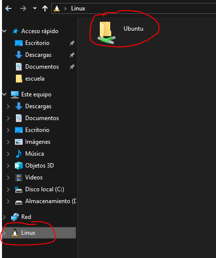
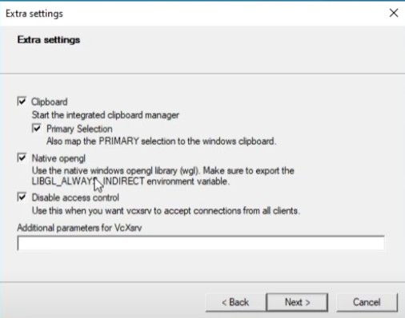
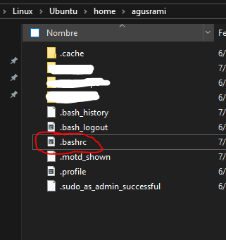

# **SUBSISTEMA LINUX EN WINDOWS**
El subsistema linux en windows (WSL) es una característica integrada en windows que genera una máquina virtual en la computadora.

## **Instalación**
1. Abre los comandos de windows (CMD o Windwos PowerShell)
2. Escribe:
```
wsl --install 
```
Esto instalará un linux Ubuntu por defecto.
Si se busca uno distinto escribir:
```
wsl --list --online 
```
Esto nos devolverá el listado de todos los disponibles. Luego:
```
wsl --install [distribution_name]
```
Si la distribución no se encuentra en las opciones puede descargarse e instalarse desde el archivo:
```
wsl --install [distribution_name] --from-file <Path>
```

3. Reiniciar la computadora. (Solo la primera vez)
4. La distribución instalada aparecerá como aplicación en la computadora y su sistema de archivos también. Puede abrirse para ejecutarse dicha terminal.



## **Interfaz visual**
Si se desea abrir aplicaciones visuales desde linux, se debe crear un servidor X en windows y enlazarlo con la máquina virtual. Para ello:

1. Instalar [vcxsrv](https://vcxsrv.com/) desde su página oficial.
2. Abrir xLauch.
3. Seguir todos los pasos por defecto salvo el último, donde se marcará como en la foto:

```Multiple Windows -> next -> Start no client -> next -> Chack Disable access control -> next```



4. Ir a la carpeta ```Linux->Home->User``` y abrir el archivo ```.bashrc```



5. agregar al final las siguientes lineas:

```
if grep -qi microsoft /proc/sys/kernel/osrelease; then
    export DISPLAY=$(grep nameserver /etc/resolv.conf | awk '{print $2}'):0.0
fi
```

6. Guardar y reabrir las terminales linux en caso de tener algunas abiertas.

Luego de realizar estos pasos, todas las terminales linux abriran programas usando xLaunch y permitirán que se ejecuten correctamente en windows.

# Informatica_I_C_code_exercises
 Repositorio Informática I r1041. Alumno Martinez, Agustin Damian
 
 Codigos generales de C. Posee los siguientes ejemplos:
 - Ejecucion de main parametrizado.
 - Estructuras.
 - Ordenamiento de datos.
 - Socket y pipe.
 - separación de procesos padre e hijo (Fork y child).

# Bibliografía/Links complementarios:
Tutorial de Youtube para WSL: [https://www.youtube.com/watch?v=Qy44XLpiChc](https://www.youtube.com/watch?v=Qy44XLpiChc)

Tutorial de Youtube para el servidor: [https://www.youtube.com/watch?v=4SZXbl9KVsw](https://www.youtube.com/watch?v=4SZXbl9KVsw)

Nota: La linea agregada en ```.bashrc``` realiza de forma automática lo mismo que en el tutorial de Yotube. El archivo ```.bashrc``` se ejecuta cada vez que se abre una terminal nueva. La linea verifica si se trata de un WSL y si ese es el caso, agrega la IP en DISPLAY como lo indica el tutorial.
